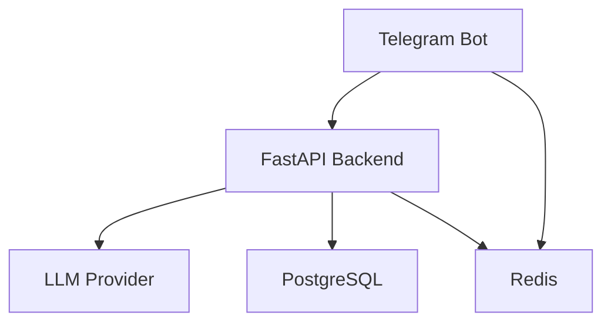

# HankeGo

HankeGo is an AI-powered travel assistant for creating, saving, and managing personalized travel itineraries.

The project is being developed as a production-style application and serves as a practical environment for learning backend development, AI engineering, testing, and application security.

## Current Status

The working application is deployed on a VPS.

Users can:

- create an itinerary through the Telegram bot;
- specify a destination, trip duration, budget, and interests;
- receive a structured day-by-day travel plan;
- view previously saved trips;
- open a specific itinerary;
- delete an itinerary after confirmation.

## Architecture



The Telegram bot is responsible only for the user interface and FSM-based dialogue flow.

The FastAPI backend:

- validates incoming data;
- enforces access rules and request limits;
- communicates with the LLM provider;
- validates structured LLM responses;
- executes business logic;
- stores users and itineraries in PostgreSQL.

Redis is used for:

- Telegram FSM state storage;
- rate limiting;
- preventing concurrent itinerary generation for the same user.

## Implemented Features

### AI

- OpenAI-compatible LLM API integration;
- Structured Output based on JSON Schema;
- strict response validation with Pydantic;
- validation of the number and sequence of itinerary days;
- retry when the model returns a logically inconsistent response;
- separation of system instructions and user-provided data;
- prompt injection risk reduction;
- user input length limits;
- safe LLM observability without logging prompts or personal data.

### Backend

- asynchronous FastAPI application;
- strict Pydantic schemas;
- SQLAlchemy 2 with asyncpg;
- Alembic database migrations;
- PostgreSQL storage for users and itineraries;
- Redis-based rate limiting;
- Redis lock for concurrent generation protection;
- internal API key authentication between the bot and backend;
- correlation IDs from Telegram updates to LLM requests;
- liveness and readiness health checks;
- external service error handling;
- unit and integration tests with pytest.

### Telegram Bot

- `/plan` — create a new itinerary;
- `/trips` — view saved itineraries;
- `/trip <id>` — open a specific itinerary;
- `/delete_trip <id>` — delete an itinerary;
- Redis-backed FSM;
- automatic splitting of long itineraries into multiple messages;
- safe backend error handling without exposing internal details.

## Technology Stack

- Python 3.11+
- FastAPI
- Pydantic
- SQLAlchemy 2
- PostgreSQL
- Alembic
- Redis
- aiogram 3
- httpx
- pytest
- uv
- systemd
- Groq OpenAI-compatible API

## Project Structure

```text
app/
├── api/            # FastAPI endpoints and dependencies
├── bot/            # Telegram bot, handlers, and API client
├── core/           # Logging, Redis, security, and request context
├── models/         # SQLAlchemy ORM models
├── repositories/   # PostgreSQL data access
├── schemas/        # Pydantic schemas
├── services/       # Business logic, LLM, rate limiting, and health checks
├── config.py       # Environment-based configuration
├── database.py     # Async SQLAlchemy engine and session factory
└── main.py         # FastAPI application
alembic/            # Database migrations
tests/              # Automated tests
```

## Local Development

### 1. Clone the Repository

```bash
git clone https://github.com/liliya-sochi/travel-ai-hankego.git
cd travel-ai-hankego
```

### 2. Install Dependencies

Install [uv](https://docs.astral.sh/uv/), then run:

```bash
uv sync
```

### 3. Configure the Environment

Linux and macOS:

```bash
cp .env.example .env
```

PowerShell:

```powershell
Copy-Item .env.example .env
```

Fill in `.env` with real configuration values. This file contains secrets and must never be committed to Git.

The application requires:

- PostgreSQL;
- Redis;
- a Telegram bot token;
- an OpenAI-compatible LLM API key;
- a randomly generated `INTERNAL_API_KEY` containing at least 32 characters.

### 4. Apply Database Migrations

```bash
uv run alembic upgrade head
```

### 5. Start the FastAPI Backend

```bash
uv run uvicorn app.main:app --reload
```

Available endpoints after startup:

- Swagger UI: `http://127.0.0.1:8000/docs`
- liveness check: `http://127.0.0.1:8000/health/live`
- readiness check: `http://127.0.0.1:8000/health/ready`

### 6. Start the Telegram Bot

Run the bot in a separate terminal:

```bash
uv run python -m app.bot.main
```

## Testing

Run the complete test suite:

```bash
uv run pytest -q
```

PostgreSQL integration tests run only when `TEST_DATABASE_URL` is configured.

For safety, the test database name must end with `_test`.

## Security

- secrets are loaded from `.env`;
- `.env` is excluded from Git;
- internal endpoints are protected with an API key;
- user-provided data is not written to application logs;
- incoming data is validated with strict Pydantic schemas;
- unknown request fields are rejected;
- itinerary generation is protected by rate limiting and Redis locks;
- itineraries can only be viewed or deleted by their owners;
- the readiness endpoint verifies PostgreSQL and Redis availability.

## Roadmap

- automated CI;
- expanded test coverage;
- improved monitoring;
- containerization;
- web interface;
- integration with additional sources of up-to-date travel information.

## License

This project is licensed under the MIT License.