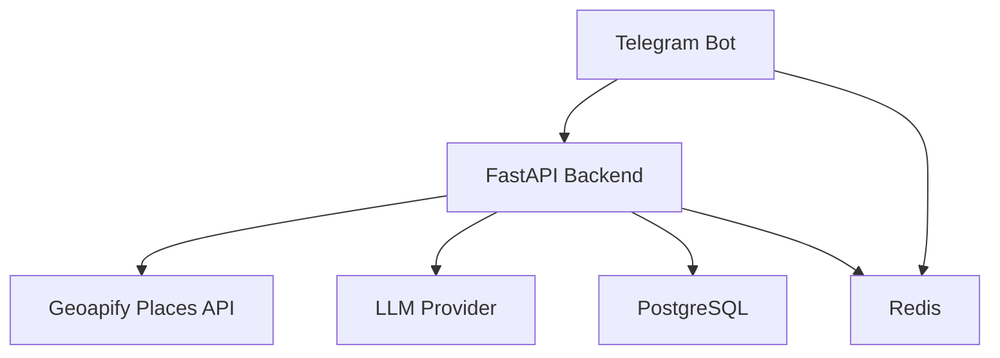

# HankeGo
[](https://github.com/liliya-sochi/travel-ai-hankego/actions/workflows/tests.yml)

HankeGo is an AI-powered travel assistant for creating, saving, and managing personalized travel itineraries.

The project is being developed as a production-style application and serves as a practical environment for learning backend development, AI engineering, testing, and application security.

## Current Status

The working application is deployed on a VPS.

Users can:

- describe a desired trip in natural language without starting with a command;
- provide trip details gradually across multiple messages;
- receive automatic follow-up questions when required information is missing;
- generate and save a structured day-by-day itinerary;
- view previously saved trips through Telegram buttons;
- open an itinerary through an inline button;
- delete an itinerary only after explicit confirmation.

## Architecture



The Telegram bot provides the conversational user interface. It stores the current dialogue state and unfinished trip draft in Redis, but it does not communicate with PostgreSQL or the LLM provider directly.

The FastAPI backend:

- validates incoming data;
- authenticates internal requests from the Telegram bot;
- extracts user intent and trip parameters through strict LLM Structured Output;
- merges newly extracted values with the current trip draft;
- determines which required fields are still missing;
- resolves the destination and retrieves candidate places from multiple geographic anchors through Geoapify;
- deterministically ranks external place candidates before they reach the LLM;
- groups nearby candidates into centered two-kilometre planning areas;
- gives the LLM an explicit geographic target for multi-day itineraries;
- retrieves detailed data for no more than five well-documented place candidates;
- deterministically adds validated opening hours and provider websites after LLM generation;
- caches validated travel contexts in Redis to avoid repeated Geoapify requests;
- provides the LLM with a trusted travel context containing real place identifiers;
- rejects itinerary places whose identifiers or names are absent from that context;
- generates complete itineraries when enough information has been collected;
- enforces access rules and request limits;
- stores users and itineraries in PostgreSQL.

Redis is used for:

- Telegram FSM state storage;
- unfinished `TripDraft` storage between user messages;
- cache-aside storage of validated `TravelContext` objects;
- separate rate limiting for conversational intake and itinerary generation;
- preventing concurrent itinerary generation for the same user.

## Implemented Features

### AI

- OpenAI-compatible LLM API integration;
- Structured Output based on JSON Schema;
- conversational intent classification for trip planning, history, and cancellation;
- structured extraction of destination, duration, travel period, budget, and interests;
- deterministic merging of extracted values with an existing trip draft;
- strict response validation with Pydantic;
- grounded itinerary generation using externally retrieved place candidates;
- one or two required activities for every morning, afternoon, and evening period;
- strict validation of every referenced place identifier and name;
- deterministic practical tips that are not generated by the LLM;
- exclusion of provider websites and opening hours from the LLM input;
- deterministic addition of verified place details to selected itinerary activities;
- explicit prevention of invented prices, schedules, opening hours, and websites;
- validation of the number and sequence of itinerary days;
- semantic retry when the model returns a logically inconsistent response;
- bounded provider retry for HTTP 429 with `Retry-After` support;
- separation of system instructions and user-provided data;
- prompt injection risk reduction;
- user input length limits;
- safe LLM observability without logging prompts or personal data.

### External Travel Data

- Geoapify geocoding for destination resolution;
- Geoapify Places API for nearby sights, museums, restaurants, parks, and entertainment;
- deterministic mapping of user interests to place categories;
- parallel retrieval of up to 120 candidates from the destination center and four shifted geographic anchors;
- deduplication of candidates returned by overlapping geographic searches;
- partial fail-open handling when only some geographic searches are unavailable;
- hybrid selection of no more than 20 places based on category coverage, proximity, data completeness, and geographic diversity;
- centered two-kilometre area groups that keep nearby places together across coordinate quadrants;
- an explicit multi-day area target passed to the LLM without exposing technical group labels to users;
- Geoapify Place Details API integration for opening hours and provider websites;
- concurrent retrieval of details for no more than five selected candidates;
- fail-open handling when optional place details are unavailable;
- explicit labeling of provider websites without claiming that they are official;
- ranking based on verified provider metadata rather than invented popularity scores;
- normalized internal travel context isolated from the provider response format;
- Redis cache-aside for validated travel contexts with a configurable TTL;
- versioned SHA-256 cache keys that do not expose destinations in plaintext;
- fail-open cache handling that falls back to Geoapify when Redis caching fails;
- Pydantic validation of cached JSON before it can be passed to the LLM;
- timeouts and safe handling of provider, network, rate-limit, and invalid-response errors;
- mandatory Geoapify and OpenStreetMap attribution in generated itineraries.

### Backend

- asynchronous FastAPI application;
- strict Pydantic schemas;
- SQLAlchemy 2 with asyncpg;
- Alembic database migrations;
- PostgreSQL storage for users and itineraries;
- reproducible multi-stage Docker image for the FastAPI backend;
- Gunicorn with Uvicorn workers for production process management;
- automated Docker image build and runtime verification in CI.
- Redis-based rate limiting;
- Redis lock for concurrent generation protection;
- internal API key authentication between the bot and backend;
- correlation IDs from Telegram updates to LLM requests;
- liveness and readiness health checks;
- external service error handling;
- unit and integration tests with pytest;
- automated test pipeline for every push and pull request;
- temporary PostgreSQL and Redis services in CI.

### Telegram Bot

- natural-language trip planning without a mandatory command;
- multi-message collection of trip preferences;
- automatic follow-up questions for missing required fields;
- Redis-backed storage of unfinished trip drafts;
- automatic itinerary generation when destination and duration are known;
- persistent reply keyboard for creating, viewing, and cancelling trips;
- inline buttons for opening and deleting saved itineraries;
- explicit confirmation before destructive deletion;
- automatic splitting of long itineraries into multiple messages;
- safe backend error handling without exposing internal details;
- legacy `/plan`, `/trips`, `/trip`, and `/delete_trip` commands for backward compatibility.

## Technology Stack

- Python 3.11+
- FastAPI
- Pydantic
- SQLAlchemy 2
- PostgreSQL
- Alembic
- Redis
- aiogram 3
- httpx
- Geoapify Geocoding, Places, and Place Details APIs
- pytest
- uv
- systemd
- Groq OpenAI-compatible API
- Docker and Docker Compose
- Gunicorn with Uvicorn workers

## Project Structure

```text
app/
├── api/            # FastAPI endpoints and dependencies
├── bot/            # Telegram bot, handlers, and API client
├── core/           # Logging, Redis, security, and request context
├── models/         # SQLAlchemy ORM models
├── repositories/   # PostgreSQL data access
├── schemas/        # Pydantic schemas
├── services/       # Business logic, LLM, rate limiting, and health checks
├── config.py       # Environment-based configuration
├── database.py     # Async SQLAlchemy engine and session factory
└── main.py         # FastAPI application
alembic/            # Database migrations
tests/              # Automated tests
Dockerfile          # Multi-stage production image
compose.yaml        # Application and infrastructure services
compose.override.yaml  # Localhost ports for development
```

## Local Development

### 1. Clone the Repository

```bash
git clone https://github.com/liliya-sochi/travel-ai-hankego.git
cd travel-ai-hankego
```

### 2. Install Dependencies

Install [uv](https://docs.astral.sh/uv/), then run:

```bash
uv sync
```

### 3. Configure the Environment

Linux and macOS:

```bash
cp .env.example .env
```

PowerShell:

```powershell
Copy-Item .env.example .env
```

Fill in `.env` with real configuration values. This file contains secrets and must never be committed to Git.

The application requires:

- PostgreSQL;
- Redis;
- a Telegram bot token;
- an OpenAI-compatible LLM API key;
- a Geoapify API key for destination geocoding and place retrieval;
- a randomly generated `INTERNAL_API_KEY` containing at least 32 characters.

`TRAVEL_CONTEXT_CACHE_TTL_SECONDS` controls how long validated Geoapify travel contexts remain in Redis. The default value is `21600` seconds, or six hours.

### 4. Apply Database Migrations

```bash
uv run alembic upgrade head
```

### 5. Start the FastAPI Backend

```bash
uv run uvicorn app.main:app --reload
```

Available endpoints after startup:

- Swagger UI: `http://127.0.0.1:8000/docs`
- liveness check: `http://127.0.0.1:8000/health/live`
- readiness check: `http://127.0.0.1:8000/health/ready`

### 6. Start the Telegram Bot

Run the bot in a separate terminal:

```bash
uv run python -m app.bot.main
```

## Testing

Run the complete test suite:

```bash
uv run pytest -q
```

PostgreSQL integration tests run only when `TEST_DATABASE_URL` is configured.

For safety, the test database name must end with `_test`.

## Security

- secrets are loaded from `.env`;
- `.env` is excluded from Git;
- internal endpoints are protected with an API key;
- user-provided data is not written to application logs;
- incoming data is validated with strict Pydantic schemas;
- unknown request fields are rejected;
- itinerary generation is protected by rate limiting and Redis locks;
- itineraries can only be viewed or deleted by their owners;
- the readiness endpoint verifies PostgreSQL and Redis availability.

## Roadmap

- enrichment of verified places with official references, prices, and schedules where reliable sources provide them;
- itinerary editing without regenerating the entire trip;
- production metrics and automated alerting;
- expanded end-to-end testing of Telegram dialogue scenarios;
- web interface using the existing FastAPI backend;
- support for additional LLM providers.

## License

This project is licensed under the MIT License.