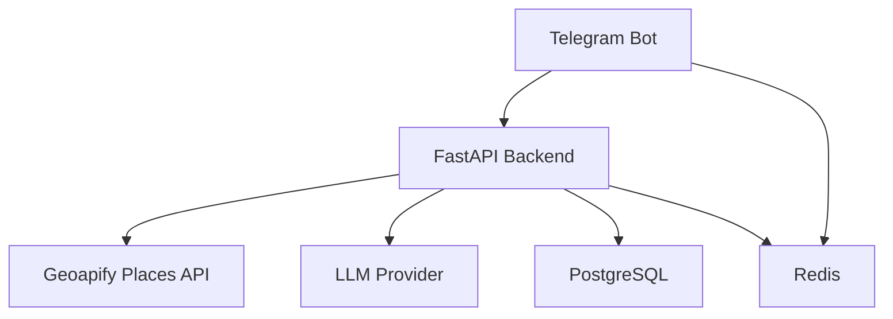

# HankeGo
[](https://github.com/liliya-sochi/travel-ai-hankego/actions/workflows/tests.yml)

HankeGo is an AI-powered travel assistant for creating, saving, and managing personalized travel itineraries.

The project is being developed as a production-style application and serves as a practical environment for learning backend development, AI engineering, testing, and application security.

## Current Status

The working application is deployed on a VPS.

Users can:

- describe a desired trip in natural language without starting with a command;
- provide trip details gradually across multiple messages;
- receive automatic follow-up questions when required information is missing;
- generate and save a structured day-by-day itinerary;
- view previously saved trips through Telegram buttons;
- open an itinerary through an inline button;
- edit a newly created itinerary directly under the Telegram result;
- request another itinerary variant with one Telegram button;
- restore the main menu and see concise guidance through `/help`;
- delete an itinerary only after explicit confirmation.

## Architecture


```mermaid
flowchart TD
    TG["Telegram Bot"] --> API["FastAPI Backend"]
    TG --> Redis["Redis"]
    API --> GEO["Geoapify Places API"]
    API --> LLM["LLM Provider"]
    API --> PG["PostgreSQL"]
    API --> Redis
```

The Telegram bot provides the conversational user interface. It stores the current dialogue state and unfinished trip draft in Redis, but it does not communicate with PostgreSQL or the LLM provider directly.

Itineraries created after the editing migration store their original validated preferences and can be changed through the actions shown immediately below a generated result. History remains available as a secondary path. Older itineraries remain available for viewing and deletion, but are deliberately not editable because their original preferences cannot be reconstructed safely from formatted text.

The FastAPI backend:

- validates incoming data;
- authenticates internal requests from the Telegram bot;
- extracts user intent and trip parameters through strict LLM Structured Output;
- merges newly extracted values with the current trip draft;
- determines which required fields are still missing;
- resolves the destination and retrieves candidate places from multiple geographic anchors through Geoapify;
- deterministically ranks external place candidates before they reach the LLM;
- groups nearby candidates into centered two-kilometre planning areas;
- gives the LLM an explicit geographic target for multi-day itineraries;
- retrieves detailed data for no more than five well-documented place candidates;
- deterministically adds validated opening hours and provider websites after LLM generation;
- displays provider-supplied Russian names, with English fallback for non-Cyrillic names, alongside the original; uses existing Geoapify search responses without extra lookups;
- retains original names and IDs for grounding and accepts displayed names when matching explicitly required places;
- caches validated travel contexts in Redis to avoid repeated Geoapify requests;
- provides the LLM with a trusted travel context containing real place identifiers;
- rejects itinerary places whose identifiers or names are absent from that context;
- generates complete itineraries when enough information has been collected;
- stores the original trip preferences for safe future editing;
- rebuilds fresh travel context and validates a complete replacement version
  before atomically saving an itinerary edit;
- accepts a newly required place during editing only when its name is present
  in the current user instruction;
- enforces access rules and request limits;
- stores users and itineraries in PostgreSQL.

Redis is used for:

- Telegram FSM state storage;
- unfinished `TripDraft` storage between user messages;
- cache-aside storage of validated `TravelContext` objects;
- separate rate limiting for conversational intake and itinerary generation;
- preventing concurrent itinerary generation or editing for the same user.

## Implemented Features

### AI

- OpenAI-compatible LLM API integration;
- separate models for short Structured Output analysis and full itinerary
  generation, preventing both workloads from competing for one model's token budget;
- Structured Output based on JSON Schema;
- conversational intent classification for trip planning, history, and cancellation;
- structured extraction of destination, duration, travel period, budget, and interests;
- deterministic merging of extracted values with an existing trip draft;
- strict response validation with Pydantic;
- grounded itinerary generation using externally retrieved place candidates;
- compact, verified place data in LLM requests and short semantic retries with
  safe validation reason codes in logs;
- one or two required activities for every morning, afternoon, and evening period;
- strict validation of every referenced place identifier and name;
- deterministic day titles derived from validated activity focuses after interest
  alignment and any local place correction; unverified LLM district and venue-type
  labels are replaced with the selected themes;
- a deterministic minimum of concrete verified places whenever the available
  travel context can support it;
- an afternoon visit matching explicit interests on one-day trips when an
  unused suitable place is available near a morning or evening visit; otherwise
  the afternoon may remain a general activity;
- an explicit shortlist of afternoon places by planning area, and bounded
  provider Retry-After handling when a grounded plan needs a semantic retry;
- preference for well-documented places while preserving sparse and explicitly
  required candidates;
- deterministic coverage of explicitly requested interest categories whenever
  verified matching places are available;
- local correction of optional afternoon visits in newly generated multi-day plans:
  a visit over 4 km from another concrete stop can be replaced with an unused,
  documented candidate supporting the same activity focus and day period, within
  4 km of every other stop that day; required visits and morning/evening stops
  are preserved, and the corrected plan is revalidated without another LLM call;
  if no suitable correction passes validation, the original valid plan is returned;
  changed summaries use the resulting place names;
- rejects summaries that call optional places required or misstate the number
  of selected parks; expects a distinct matching park or restaurant in the
  evening on one-day trips when that interest and suitable candidates exist;
- deterministic practical tips that are not generated by the LLM;
- exclusion of provider websites and opening hours from the LLM input;
- deterministic schedule-aware validation of places against compatible day periods;
- no evening museum, restaurant or entertainment visit without known opening hours;
- deterministic addition of verified place details to selected itinerary activities;
- explicit prevention of invented prices, schedules, opening hours, and websites;
- validation of the number and sequence of itinerary days;
- semantic retry when the model returns a logically inconsistent response;
- bounded provider retry for HTTP 429 with `Retry-After` support;
- one bounded grounded-plan retry when Groq rejects generated JSON against the strict schema;
- separation of system instructions and user-provided data;
- prompt injection risk reduction;
- user input length limits;
- safe LLM observability without logging prompts or personal data.
- rolling production reports for LLM attempts and final AI API responses, with
  error-threshold alerts through the existing host monitor.
- explicit validation reason codes for grounded-plan failures without logging model output.

### External Travel Data

- Geoapify geocoding for destination resolution;
- Geoapify Places API for nearby sights, museums, restaurants, parks, and entertainment;
- deterministic mapping of user interests to place categories;
- explicit history interests use Geoapify's historic-building category when matching places are available;
- parallel retrieval of up to 120 candidates from the destination center and four shifted geographic anchors;
- deduplication of candidates returned by overlapping geographic searches;
- partial fail-open handling when only some geographic searches are unavailable;
- hybrid selection of no more than 20 places based on category coverage, proximity, data completeness, and geographic diversity;
- explicit user-interest categories take priority in the nearby and documented
  portions of candidate selection; documented alternatives are balanced across
  those categories, with other candidates filling available slots;
- centered two-kilometre area groups that keep nearby places together across coordinate quadrants;
- an explicit multi-day area target passed to the LLM without exposing technical group labels to users;
- Geoapify Place Details API integration for opening hours and provider websites;
- safe inference of morning, afternoon, and evening availability from common OSM opening-hours syntax, including calendar exceptions;
- opt-in Google Places fallback only for schedule-sensitive venues whose Geoapify opening hours are missing;
- rejection of places marked temporarily or permanently closed by a matched Google result;
- safe handling of verified place relocations when Google and Geoapify reference the same specific provider page;
- reconciles a relocated place's categories with Google types and avoids unrelated relocated venues in one-day plans with explicit interests;
- deterministic enforcement of explicitly required places in generated itineraries;
- category-validated activity focuses with deterministic descriptions for concrete places;
- safe Russian formatting for common OSM weekday and calendar-date schedules;
- request-scoped Google lookup for required places missing from the cached shortlist;
- deterministic category filtering, a per-trip cap, and a global monthly Redis budget for Google lookups;
- fail-closed Google budget enforcement and fail-open itinerary generation when the optional fallback is unavailable;
- Google opening hours are applied after the Geoapify cache and are not persisted in the travel-context cache;
- concurrent retrieval of details for no more than five selected candidates;
- fail-open handling when optional place details are unavailable;
- explicit labeling of provider websites without claiming that they are official;
- ranking based on verified provider metadata rather than invented popularity scores;
- normalized internal travel context isolated from the provider response format;
- Redis cache-aside for validated travel contexts with a configurable TTL;
- travel-context cache keys include explicit ranking priorities as well as
  search categories; the cache namespace is versioned when selection changes;
- versioned SHA-256 cache keys that do not expose destinations in plaintext;
- fail-open cache handling that falls back to Geoapify when Redis caching fails;
- Pydantic validation of cached JSON before it can be passed to the LLM;
- timeouts and safe handling of provider, network, rate-limit, and invalid-response errors;
- mandatory Geoapify and OpenStreetMap attribution in generated itineraries.

### Backend

- asynchronous FastAPI application;
- strict Pydantic schemas;
- SQLAlchemy 2 with asyncpg;
- Alembic database migrations;
- PostgreSQL storage for users and itineraries;
- owner-scoped atomic updates of saved itineraries;
- reproducible multi-stage Docker image for the FastAPI backend;
- Gunicorn with Uvicorn workers for production process management;
- automated Docker image build and runtime verification in CI.
- Redis-based rate limiting;
- Redis lock for concurrent generation and editing protection;
- internal API key authentication between the bot and backend;
- correlation IDs from Telegram updates to LLM requests;
- liveness and readiness health checks;
- external service error handling;
- unit and integration tests with pytest;
- automated test pipeline for every push and pull request;
- temporary PostgreSQL and Redis services in CI.

### Telegram Bot

- natural-language trip planning without a mandatory command;
- multi-message collection of trip preferences;
- automatic follow-up questions for missing required fields;
- Redis-backed storage of unfinished trip drafts;
- automatic itinerary generation when destination and duration are known;
- persistent reply keyboard for creating, viewing, and cancelling trips;
- inline buttons for opening, editing, and deleting saved itineraries;
- one-message natural-language editing within the same destination and duration;
- explicit confirmation before destructive deletion;
- automatic splitting of long itineraries into multiple messages;
- safe backend error handling without exposing internal details;
- legacy `/plan`, `/trips`, `/trip`, and `/delete_trip` commands for backward compatibility.

## Technology Stack

- Python 3.11+
- FastAPI
- Pydantic
- SQLAlchemy 2
- PostgreSQL
- Alembic
- Redis
- aiogram 3
- httpx
- Geoapify Geocoding, Places, and Place Details APIs
- Google Places API (New), optional opening-hours fallback
- pytest
- uv
- systemd
- Groq OpenAI-compatible API
- Docker and Docker Compose
- Gunicorn with Uvicorn workers

## Project Structure

```text
app/
├── api/            # FastAPI endpoints and dependencies
├── bot/            # Telegram bot, handlers, and API client
├── core/           # Logging, Redis, security, and request context
├── models/         # SQLAlchemy ORM models
├── repositories/   # PostgreSQL data access
├── schemas/        # Pydantic schemas
├── services/       # Business logic, LLM, rate limiting, and health checks
├── config.py       # Environment-based configuration
├── database.py     # Async SQLAlchemy engine and session factory
└── main.py         # FastAPI application
alembic/            # Database migrations
tests/              # Automated tests
Dockerfile          # Multi-stage production image
compose.yaml        # Application and infrastructure services
compose.override.yaml  # Localhost ports for development
```

## Local Development

### 1. Clone the Repository

```bash
git clone https://github.com/liliya-sochi/travel-ai-hankego.git
cd travel-ai-hankego
```

### 2. Install Dependencies

Install [uv](https://docs.astral.sh/uv/), then run:

```bash
uv sync
```

### 3. Configure the Environment

Linux and macOS:

```bash
cp .env.example .env
```

PowerShell:

```powershell
Copy-Item .env.example .env
```

Fill in `.env` with real configuration values. This file contains secrets and must never be committed to Git.

The application requires:

- PostgreSQL;
- Redis;
- a Telegram bot token;
- an OpenAI-compatible LLM API key;
- a Geoapify API key for destination geocoding and place retrieval;
- a randomly generated `INTERNAL_API_KEY` containing at least 32 characters.

`LLM_ANALYSIS_MODEL` is used for conversational intake and edit-instruction
analysis. `LLM_MODEL` is reserved for full grounded itinerary generation. With
Groq, the recommended values are `openai/gpt-oss-20b` and
`openai/gpt-oss-120b`, respectively.

`TRAVEL_CONTEXT_CACHE_TTL_SECONDS` controls how long validated Geoapify travel contexts remain in Redis. The default value is `21600` seconds, or six hours.

### 4. Apply Database Migrations

```bash
uv run alembic upgrade head
```

### 5. Start the FastAPI Backend

```bash
uv run uvicorn app.main:app --reload
```

Available endpoints after startup:

- Swagger UI: `http://127.0.0.1:8000/docs`
- liveness check: `http://127.0.0.1:8000/health/live`
- readiness check: `http://127.0.0.1:8000/health/ready`

### 6. Start the Telegram Bot

Run the bot in a separate terminal:

```bash
uv run python -m app.bot.main
```

## Testing

Run the complete test suite:

```bash
uv run pytest -q
```

PostgreSQL integration tests run only when `TEST_DATABASE_URL` is configured.

For safety, the test database name must end with `_test`.

`tests/test_trip_lifecycle_integration.py` runs complete HTTP scenarios against
real trip services, grounded-response validation, repositories, and PostgreSQL.
Fixed LLM and travel-data responses cover creation, required-place preservation,
editing and reopening, rejected duration changes, invalid generated edits, and
owner-only access. Each HTTP request uses a separate database session. These
scenarios check application behavior, not the quality of live model generations.
They run in the existing CI PostgreSQL job and require a migrated
`TEST_DATABASE_URL` locally. The shared integration fixture truncates `trips` and
`users`; use a dedicated disposable test database, never a development or production
database containing data you need to keep.

### Telegram Dialogue Integration Tests

`tests/test_bot_dialogue_integration.py` feeds typed messages and callbacks into
the same Dispatcher assembly used by the running bot. It checks router filters,
command arguments, draft preservation between turns and after generation errors,
recovery through a new RedisStorage connection, creation and history callbacks,
editing retries, menu transitions, non-text input, and isolation between users.
The `/plan` handler accepts an optional trip description after the command;
without arguments, it starts an empty planning dialogue.

The suite uses real Redis FSM storage, the bot's API payload serialization and
response validation, and its public formatter. Telegram API and backend HTTP
responses are fixed test doubles, so these checks complement the PostgreSQL
HTTP lifecycle tests and live Telegram smoke tests. Reconnecting storage checks
persisted FSM data; it does not simulate a full process restart or polling.

Use an explicitly configured local Redis database 15:

```bash
TEST_REDIS_URL=redis://127.0.0.1:6379/15 uv run pytest -q tests/test_bot_dialogue_integration.py
```

Without `TEST_REDIS_URL`, this module is skipped. A configured unavailable Redis
fails the tests. Each run uses a unique key prefix and deletes only its own keys,
without flushing Redis. The existing CI Redis service runs these tests together
with the full suite; real Telegram credentials and model calls are unnecessary.

### Live Model Evaluation

List and validate the fixed evaluation scenarios without network access:

```bash
python -m scripts.evaluate_routes
```

Run one scenario against the configured real LLM (uses quota or paid tokens):

```bash
python -m scripts.evaluate_routes --live --case tokyo_required_parks --repeat 3
```

Run the complete corpus explicitly:

```bash
python -m scripts.evaluate_routes --live --case all --repeat 3
```

`evals/route_cases.json` contains four scenarios: Istanbul history/architecture,
Tokyo with a required museum and parks, replacing parks with museums and a general
evening, and rejection of a duration change. Creation starts from prepared
`TripPreferences`, so it does not evaluate conversational intake. Edit cases use
the real analysis model and a fixed original plan; expected rejected edits stop
after analysis. The tool calls the same AI functions, bounded retries, validation,
and optional local geography correction as the application. It uses fixed travel
contexts and makes no Geoapify, Google, Redis, PostgreSQL, or HTTP API calls.
Existing `.env` settings must be valid, but those other services need not run.

The corpus is evaluation data, not current travel advice. Istanbul coordinates
come from the user-provided candidate snapshot; Tokyo coordinates and all IDs,
addresses, and opening hours are synthetic. Fixed category data and deliberate
off-interest/distant candidates make runs comparable across prompt changes.

JSON reports in ignored `evals/results/` distinguish `passed`, `quality_failed`,
`service_error`, and `runner_error`. They include the final public plan, independent
required-place/category/count checks, and maximum **straight-line pair distance**
within each day (4 km target, not a walking distance or travel-time estimate).
Visits are identified by the public formatter's unique place-name prefixes, not
mentions in summaries. General activities have no coordinates. The evening-edit
check verifies absence of concrete visits; whether its text describes calm rest,
and the overall itinerary's appeal, still require human review.

Reports also include model names, corpus/code hashes, latency, safe per-call
metadata, retry usage, and known token totals. Missing usage is marked explicitly;
totals are not a billing estimate. Each completed run is saved immediately, so an
interrupted batch retains partial results. Existing reports are not overwritten;
`--output PATH` chooses a new destination. A 65-second pause separates scenarios
by default; `--interval-seconds` adjusts it. This reduces immediate quota pressure
but does not guarantee that the provider accepts every call. No batch-level retry
is added. A few runs expose regressions, not a statistically reliable success rate.

Without `--live`, settings are not loaded and no requests are sent. Live execution
also requires an explicit `--case`; repetitions are limited to 1–10. Exit codes:
0 = all criteria passed, 1 = quality/service failure, 2 = configuration/tool error,
130 = interrupted. CI tests the runner with mocked AI boundaries; it never enables
live evaluation or requires real API keys.

#### Conversational Intake Evaluation

Validate and list the separate intake corpus without model calls:

```bash
python -m scripts.evaluate_routes --suite intake
```

Run one conversation or the complete intake corpus against the analysis model:

```bash
python -m scripts.evaluate_routes --suite intake --live --case intake_dialogue_completion --repeat 1
python -m scripts.evaluate_routes --suite intake --live --case all --repeat 1 --output evals/results/intake-baseline.json
```

`evals/intake_cases.json` contains eight cases and eleven messages: complete
requests, an explicit required museum, collecting missing fields over three
turns, replacing interests and adding a required place, cancellation, history,
an unrelated question, and an instruction attempting to override extraction.
The tool calls the real `process_trip_message` service, including the analysis
LLM, strict validation, draft merge, readiness decision, and next question.
It does not generate itineraries or access Telegram, HTTP API, Redis, PostgreSQL,
Geoapify, or Google. Initial drafts and messages are fixed test data.

Each next turn receives the **actual** draft returned by the previous turn.
The runner never replaces it with the expected draft. It stops a case at the
first failed check or service error and continues with the next independent
case. Dialogues end when ready to generate or after a non-planning intent.
The default 65-second interval separates both cases and turns. The full corpus
takes roughly twelve minutes without provider retries; `--case ID` selects a
smaller run. Each repeat starts from a fresh initial draft.

Checks compare intent, all six draft fields, missing required fields, readiness,
and the deterministic next question. Text comparisons ignore case and whitespace;
required-place lists ignore order but retain duplicate counts. Selected cases
use required/excluded substrings for interests to allow different wording.
These simple checks do not establish semantic equivalence or comprehensive
prompt-injection protection; review the saved responses as well.

Reports include the corpus type, planned case/message counts, each attempted
turn's message, input draft, expected criteria, public response, and checks.
Latency/token/retry metadata covers the entire case, including pauses between
turns. Case latency therefore differs from a single-message API response time.
Completed cases are checkpointed; if interrupted during a multi-turn case,
that unfinished case is not saved. Corpus/code hashes and exit codes follow the
route evaluator above. Without `--suite`, existing route commands remain valid.
CI tests both corpora with mocked provider responses and never runs live calls.

## Production AI Monitoring

`scripts/report_production.py` reads application logs from stdin and prints a JSON
report using only Python's standard library (host Python 3.10+). It does not load `.env`, call models,
or access application databases. It accepts ordinary application lines and Docker
Compose prefixes; Uvicorn access logs are ignored to prevent double counting.
Application timestamps are interpreted as UTC, as in the production containers.

Read a fresh 30-minute window manually on the VPS:

```bash
docker compose -f compose.yaml -f compose.prod.yaml --profile bot logs --no-color --since 30m api 2>&1 \
  | python3 scripts/report_production.py --window-minutes 30
```

The report separates final `POST /trip-intake`, `/trip-plan`, and `/trip-edit`
responses from individual LLM calls. It includes per-operation HTTP statuses and
p50/p95 latency, per-model attempt outcomes, retry calls, scheduled retry events,
and known token sums. Missing usage is counted explicitly; sums are not billing
estimates. Latency uses nearest-rank percentiles and includes failed attempts or
requests. These are technical reliability metrics, not an assessment of itinerary
appeal, correctness beyond existing validation, or successful Telegram delivery.

`scripts/monitor_production.sh` collects API logs with a 20-second timeout on each
existing five-minute timer run. It atomically saves the latest valid report as
`ai-report.json` in its private state directory (normally
`/var/lib/hankego-monitor`, file mode 0600). A collection or parsing failure keeps
the previous report and adds a monitoring error; check the report's UTC window
before treating it as current. Raw logs, prompts, response bodies, correlation IDs,
and provider request IDs are not copied into the report or notifications.

Defaults, configurable in the host's `.env` through systemd's `EnvironmentFile`:

- `HANKEGO_AI_WINDOW_MINUTES=30` (1–1440);
- `HANKEGO_AI_MIN_REQUESTS=5` (1–100000, separately for each operation);
- `HANKEGO_AI_MAX_SERVER_ERROR_PERCENT=50` (1–100).

The threshold is reached when an operation has at least five **2xx + 5xx** results
and at least half are 5xx within the rolling window. Unhandled request failures
count as 500. Expected 4xx responses, including validation, ownership, locks, and
local rate limits, are reported but excluded from this availability denominator.
An exhausted provider rate limit becomes 503 and is included. Successful intake
does not hide failed generation; an LLM attempt recovered by retry does not count
as a failed API request.

Low traffic is marked `insufficient_data`, not proof of availability, and does not
trigger a threshold alert. The existing monitor sends a problem notification on
the transition to failed and a recovery notification when all monitored conditions
clear. A rolling-window alert can clear as old failures expire, even without new
requests; recovery means the configured conditions cleared, not that the model
was actively retested. Collection spans current Compose containers and retained
Docker logs, not a durable cross-deployment metrics history.

For automation, `--check` returns 1 when an API threshold is reached; normal or
insufficient data returns 0. Invalid known events, input failures, or configuration
errors return 2. Without `--check`, a valid report returns 0 even when degraded.
`--api-prefix` supports a non-default API prefix. Health checks, backups, disk
checks, and notification deduplication continue in the same host monitor. No API
or bot restart is required to update these host-side scripts.

Tests cover real logger/middleware formats, recovered attempts, per-operation
thresholds, UTC boundaries, partial usage, malformed events, privacy, and CLI
exit codes. Linux CI also executes the monitor with fake Docker/system commands
and intercepted Telegram notifications, checking alert/recovery transitions and
failed report collection. These shell tests are skipped on Windows; they never
contact Docker, Telegram, or a production server.

## Security

- secrets are loaded from `.env`;
- `.env` is excluded from Git;
- internal endpoints are protected with an API key;
- user-provided data is not written to application logs;
- incoming data is validated with strict Pydantic schemas;
- unknown request fields are rejected;
- itinerary generation is protected by rate limiting and Redis locks;
- itineraries can only be viewed, edited, or deleted by their owners;
- the readiness endpoint verifies PostgreSQL and Redis availability.

## Roadmap

- enrichment of verified places with official references, prices, and schedules where reliable sources provide them;
- durable production metrics history and alert calibration as traffic grows;
- broader Telegram dialogue and live evaluation scenarios;
- web interface using the existing FastAPI backend;
- support for additional LLM providers.

## License

This project is licensed under the MIT License.
